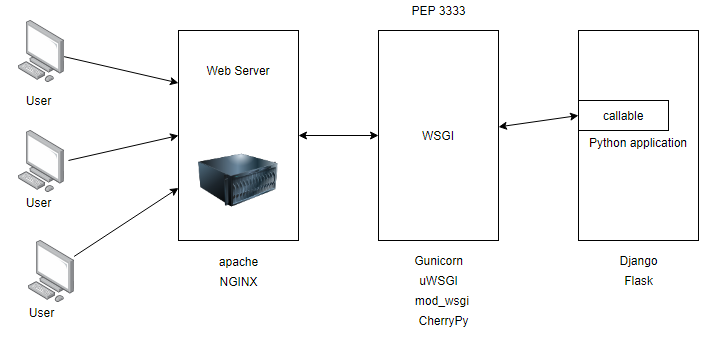

# Разворачивание проекта на Django. <br> Стек *Nginx-Unicorn-Django* + Postgres

## Условности

[Источник](https://www.digitalocean.com/community/tutorials/how-to-set-up-django-with-postgres-nginx-and-gunicorn-on-ubuntu-20-04-ru)
`myproject` - имя проекта
`myprojectuser` - пользователь проекта

Схема:



## Порядок работы

+ Устанавливаем и настраиваем недостающие пакеты Python и Postgres
+ инициализируем и настраиваем проект Django
+ создаём файлы Gunicorn для systemd
+ настраиваем проксирование Nginx.

## Донастройка интерпретатора и установка БД

Для работы проекта на Django обязательно требуется связь с базой данных. В качестве БД может использоваться SQLite, но традиционой для продуктовых систем является СУБД PostgreSQL. Установим её. Также для Python нам нужно доустановить некоторые пакеты, которые необходимы для стабильной работы среды разработки.

```shell
sudo apt install python3-pip python3-dev libpq-dev postgresql postgresql-contrib
```
Что касается Postgres, нужно создать базу для проекта и пользователя. Для начала входим в СУБД от имени системного пользователя `postgres`:

```shell
sudo -u postgres psql
```
Не забывая про точки с запятой в конце создаём сначала базу данных, а потом пользователя.
```sql
CREATE DATABASE myproject;
CREATE USER myprojectuser WITH PASSWORD 'password';
```

Затем настраиваем пользователя. Нужно прописать следующие параметры пользователя:
+ `client_encoding` - кодировка базы
+ `default_transaction_isolation` - уровень изоляции при транзакции
+ `timezone` - временная зона

```sql
ALTER ROLE myprojectuser SET client_encoding TO 'utf8';
ALTER ROLE myprojectuser SET default_transaction_isolation TO 'read committed';
ALTER ROLE myprojectuser SET timezone TO 'UTC';

# Выходим
\q
```

## Работа с Django

Для начала устанавливаем виртуальное окружение, а потом зависимости, среди которых будет и Django. Создадим директорию для нашего проекта. Пусть она будет находиться в `/var/www`. Установим зависимости из файла. Файл `requirements.txt`:

```text
Django==4.1.5
gunicorn==20.1.0
psycopg2-binary==2.9.5
```

```bash
cd /var/www/
mkdir myproject
cd myproject/

python -m venv venv
source venv/bin/activate
pip install -r requirements.txt
```

Внутри папки проекта будет располагаться директория с проектом. Чтобы её создать, инициализируем проект Django следующей командой:

```shell
django-admin startproject myproject .
```

Команда создаёт каталог `myproject/` в текущей (`.`) папке. Соответственно, можно задать и другое имя и другое расположение. В папке будет следующий набор файлов:
```shell
~ tree myproject 
myproject
├── asgi.py
├── __init__.py
├── __pycache__
├── settings.py
├── urls.py
└── wsgi.py
```
Позднее опишем назначение каждого файла отдельно.

### Настройки проекта

В файле `myproject/myproject/settings.py` производим следующие настройки:

**Правим** `ALLOWED_HOSTS` - разрешённые IP адреса и доменные имена, то есть те, с которых можно обратиться к скриптам. Например `ALLOWED_HOSTS = ['127.0.0.1', '192.168.2.101']`

**Переписываем подключение к базе данных.** По умолчанию имеем подключение к базе SQLite.

```python
DATABASES = {
    'default': {
        'ENGINE': 'django.db.backends.postgresql_psycopg2',
        'NAME': 'myproject',
        'USER': 'myproject',
        'PASSWORD': 'password',
        'HOST': 'localhost',
        'PORT': '',
    }
}
```

**Прописываем путь к статике** (с точки зрения Python - это HTML, CSS и JS). 
```python
STATIC_URL = '/static/'
STATIC_ROOT = [
    BASE_DIR / "static/",
]
```


**Настраиваем и осуществляем миграции.** Это делается через скрипт `manage.py`:
```shell
python manage.py makemigration
python manage.py migrate
```
Первая команда создаёт файлы миграции. На данном этапе у нас будут отсутствовать какие-либо изменения в файлах моделей. Вторая команда осуществляет миграции. Это означает, что Django создаст все необходимые таблицы и поля. Всякий раз при создании приложений, мы будем повторять эти команды.

**Создаём суперпользователя.** Это нужно для входа в административную панель.
```shell
python manage.py createsuperuser
```
Выскочит диалог, который запросит имя, почту и пароль.

**Переносим всю статику в нужный каталог.**
На данный момент статика имеется только для заглушки самого фреймворка.
```shell
python manage.py collectstatic
```

Также по мелочи настраиваем язык и временную зону в соответствующих константах. Если есть файервол, то нужно открыть порт, по которому мы будем обращаться к скриптам через браузер.

Проверяем работу, запустив сервер Django:

```shell
python manage.py runserver 0.0.0.0:8000
```

Проверяем через браузер по адресу `127.0.0.1`, если Django работает на локальной машине. Также следует проверить адрес `http://127.0.0.1/admin/`


## Работа с Gunicorn

Сначала проверяем работает ли сервер Gunicorn ("Green Unicorn").

```shell
gunicorn --bind 0.0.0.0:8000 myproject.wsgi
```


which gunicorn
